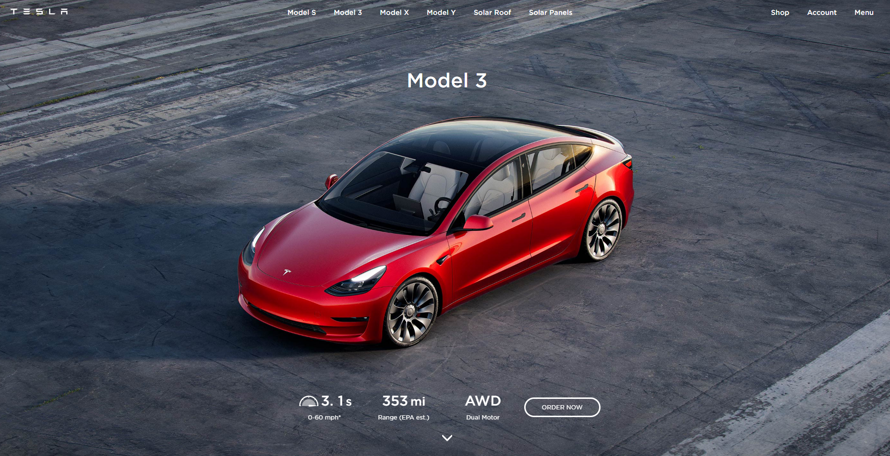

# Tesla

## About:

Clone of Tesla website ,
This project is a part of Appleseeds Bootcamp weekend assignment.

 ## Languages and Tools:

  
 
 
 
 

## 🚀 Demo:

https://teal-truffle-8aac20.netlify.app/

